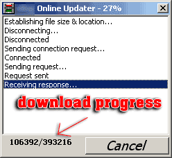



## A1 Updater

### Description

Once your app decides that there is a newer version available (through your own methods), you can use this program to download the newest version. It downloads via HTTP using the inet control and can be outfitted to update just about anything. Features include cancel action, listbox with verbiage of the download status and status in numbers. It's ver simple and straight forward. It works by you closing the main app and launching the updater. The updater then replaces the existing main app's .exe, then upon completion closes and launches the updated program.
 
### More Info
 

             |
---                |---
**Submitted On**   |2004-05-01 17:23:02
**By**             |[C\.Smith](https://github.com/Planet-Source-Code/PSCIndex/blob/master/ByAuthor/c-smith.md)
**Level**          |Intermediate
**User Rating**    |5.0 (35 globes from 7 users)
**Compatibility**  |VB 6\.0
**Category**       |[Internet/ HTML](https://github.com/Planet-Source-Code/PSCIndex/blob/master/ByCategory/internet-html__1-34.md)
**World**          |[Visual Basic](https://github.com/Planet-Source-Code/PSCIndex/blob/master/ByWorld/visual-basic.md)
**Archive File**   |[A1\_Updater173964512004\.zip](https://github.com/Planet-Source-Code/c-smith-a1-updater__1-53504/archive/master.zip)

